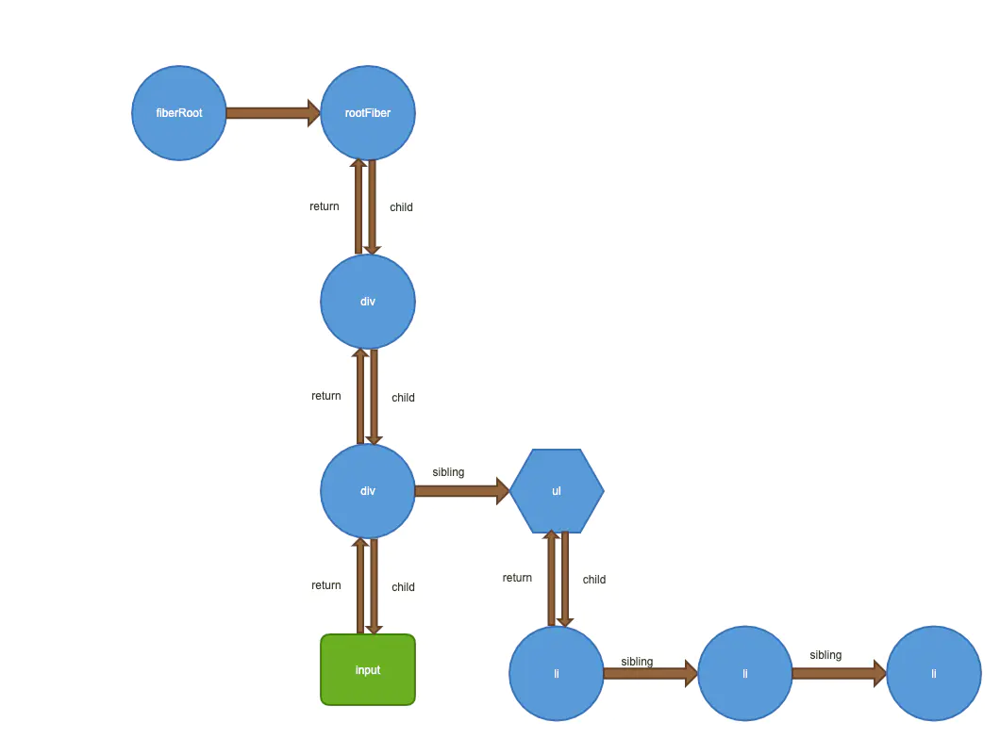

# Fiber

这个概念是React16引入进来，让框架可以更细粒度的调节任务调度，数据结构就是下边这样调用ReactDOM.render就会生成一个FiberRoot节点，FiberRoot的current属性指向一个RootFiber节点，每个fiber节点只有一个子节点，如果有同级的节点是通过fiber的sibiling指向的，return指向当前节点的父节点，这样以类似链表的方式将一颗树串联起来，
react中很多数据结构都是使用**链表**实现的。
例如我们有下边这样一个组件,用图形描述出来就像下边这样

```js
export default class FiberComponent extends Component{
  constructor(){
    super()
    this.state = {
      list:[1,2,3]
    }
  }
  render(){
    const { list } = this.state
    return (
      <div>
        <div>
          <input />
        </div>
        <ul>
          {
            list.map((item, index) => (
              <li key={index}>
                {item}
              </li>
            ))
          }
        </ul>
      </div>
    )
  }
}
```



```js
export type Fiber = {|
  // These first fields are conceptually members of an Instance. This used to
  // be split into a separate type and intersected with the other Fiber fields,
  // but until Flow fixes its intersection bugs, we've merged them into a
  // single type.

  // An Instance is shared between all versions of a component. We can easily
  // break this out into a separate object to avoid copying so much to the
  // alternate versions of the tree. We put this on a single object for now to
  // minimize the number of objects created during the initial render.

  // Tag identifying the type of fiber.
  tag: WorkTag,

  // Unique identifier of this child.在父组件中的唯一标识
  key: null | string, 

  // The value of element.type which is used to preserve the identity during
  // reconciliation of this child.
  elementType: any,

  // The resolved function/class/ associated with this fiber.
  type: any, // function组件，class组件，字符串表示原生例如div

  // The local state associated with this fiber.
  stateNode: any, // 普通fiber指向的是dom节点

  // Conceptual aliases
  // parent : Instance -> return The parent happens to be the same as the
  // return fiber since we've merged the fiber and instance.

  // Remaining fields belong to Fiber

  // The Fiber to return to after finishing processing this one.
  // This is effectively the parent, but there can be multiple parents (two)
  // so this is only the parent of the thing we're currently processing.
  // It is conceptually the same as the return address of a stack frame.
  return: Fiber | null, // 父节点

  // Singly Linked List Tree Structure.
  child: Fiber | null, // 第一个子元素
  sibling: Fiber | null, // 下一个兄弟元素
  index: number, // 在父组件中的位置

  // The ref last used to attach this node.
  // I'll avoid adding an owner field for prod and model that as functions.
  ref: null | (((handle: mixed) => void) & {_stringRef: ?string}) | RefObject, // 当前dom引用

  // Input is the data coming into process this fiber. Arguments. Props.
  pendingProps: any, // This type will be more specific once we overload the tag.  新的props
  memoizedProps: any, // The props used to create the output. 上一次更新旧的props

  // A queue of state updates and callbacks.
  updateQueue: UpdateQueue<any> | null, // 存放要更新内容的链表

  // The state used to create the output
  memoizedState: any, // 上一次更新的state

  // A linked-list of contexts that this fiber depends on
  contextDependencies: ContextDependencyList | null,

  // Bitfield that describes properties about the fiber and its subtree. E.g.
  // the ConcurrentMode flag indicates whether the subtree should be async-by-
  // default. When a fiber is created, it inherits the mode of its
  // parent. Additional flags can be set at creation time, but after that the
  // value should remain unchanged throughout the fiber's lifetime, particularly
  // before its child fibers are created.
  mode: TypeOfMode,

  // Effect
  effectTag: SideEffectTag, // 在commit阶段会用到标记effect的类型

  // Singly linked list fast path to the next fiber with side-effects.
  nextEffect: Fiber | null, // 指向下一个effect

  // The first and last fiber with side-effect within this subtree. This allows
  // us to reuse a slice of the linked list when we reuse the work done within
  // this fiber.
  firstEffect: Fiber | null,
  lastEffect: Fiber | null,

  // Represents a time in the future by which this work should be completed.
  // Does not include work found in its subtree.
  expirationTime: ExpirationTime, // 当前fiber的到期时间

  // This is used to quickly determine if a subtree has no pending changes.
  childExpirationTime: ExpirationTime, // 子节点优先级最高的到期时间

  // This is a pooled version of a Fiber. Every fiber that gets updated will
  // eventually have a pair. There are cases when we can clean up pairs to save
  // memory if we need to.
  alternate: Fiber | null, // 工作的fiber备份
|};
```

