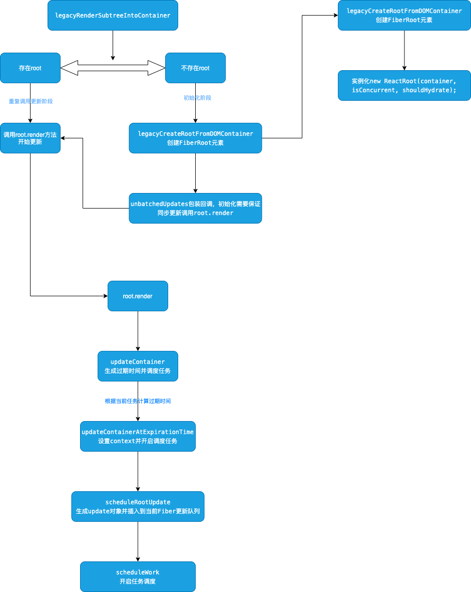

# render方法

做为入口方法ReactDOM的入口方法，实际调用的是`legacyRenderSubtreeIntoContainer`
首先要做的就是判断之前是否生成过root元素也就是FiberRoot元素，这是所有Fiber树的根节点，如果不存在说明是第一次挂载组件,第一次挂载需要创建一个root节点，然后通过`unbatchedUpdates`包裹回调调用`root.render`方法,这个方法会让任务调度时采用最高优先级SYNC工作，最终会调用`updateContainer`方法。这里看出react的挂载更新都是从root元素开始更新的



```js
function legacyRenderSubtreeIntoContainer(
  parentComponent: ?React$Component<any, any>,
  children: ReactNodeList,
  container: DOMContainer,
  forceHydrate: boolean,
  callback: ?Function,
) {
  let root: Root = (container._reactRootContainer: any);
  if (!root) {
    // Initial mount初始化渲染
    root = container._reactRootContainer = legacyCreateRootFromDOMContainer(
      container,
      forceHydrate,
    );
    if (typeof callback === 'function') {
      const originalCallback = callback;
      callback = function() {
        const instance = getPublicRootInstance(root._internalRoot);
        originalCallback.call(instance);
      };
    }
    // Initial mount should not be batched.
    // 同步初始化
    unbatchedUpdates(() => {
      if (parentComponent != null) {
        root.legacy_renderSubtreeIntoContainer(
          parentComponent,
          children,
          callback,
        );
      } else {
        root.render(children, callback);
      }
    });
  } else {
    if (typeof callback === 'function') {
      const originalCallback = callback;
      callback = function() {
        const instance = getPublicRootInstance(root._internalRoot);
        originalCallback.call(instance);
      };
    }
    // Update
    if (parentComponent != null) {
      root.legacy_renderSubtreeIntoContainer(
        parentComponent,
        children,
        callback,
      );
    } else {
      root.render(children, callback);
    }
  }
  return getPublicRootInstance(root._internalRoot);
}

// FiberRoot构造函数
function ReactRoot(
  container: DOMContainer,
  isConcurrent: boolean,
  hydrate: boolean,
) {
  const root = createContainer(container, isConcurrent, hydrate);
  this._internalRoot = root;
}
ReactRoot.prototype.render = function(
  children: ReactNodeList, // 实际上传入的ReactELement
  callback: ?() => mixed,
): Work {
  const root = this._internalRoot;
  const work = new ReactWork();
  callback = callback === undefined ? null : callback;
  if (callback !== null) {
    work.then(callback);
  }
  updateContainer(children, root, null, work._onCommit);
  return work;
};
```

reactFiber有一个特性可以让任务调度更合理，我们要保证用户主动触发的动作高优先级执行，不会因为一个耗时任务在执行从而导致无法响应用户的操作，fiber就是解决这个问题的，将不同行为触发的事件采用不同的优先级，`expirationTime`就是实现这个能力一个很重要的内容，主要作用就是根据规则计算出时间，我要在这个时间内，完成这个任务，高优先级的任务就要在短时间内完成，如果超时了就要立即执行，保证了不会因为插队进来了，任务就一直阻塞不执行，当一个高优先级的任务插队进来了，需要执行高优先级的任务，这个都是react的任务调度器帮我们实现的，后边会说到。


```js
// 更新FiberRoot节点 初始化更新都会调用
export function updateContainer(
  element: ReactNodeList,
  container: OpaqueRoot,
  parentComponent: ?React$Component<any, any>,
  callback: ?Function,
): ExpirationTime {
  const current = container.current; // 获取跟节点的rootFiber
  const currentTime = requestCurrentTime(); // 获取当前时间now-初始化时间
  const expirationTime = computeExpirationForFiber(currentTime, current); // 初始化时是SYNC也就是最大优先级
  return updateContainerAtExpirationTime(
    element,
    container,
    parentComponent,
    expirationTime,
    callback,
  );
}
// 设置context并开启root update
export function updateContainerAtExpirationTime(
  element: ReactNodeList,
  container: OpaqueRoot,
  parentComponent: ?React$Component<any, any>,
  expirationTime: ExpirationTime,
  callback: ?Function,
) {
  // TODO: If this is a nested container, this won't be the root.
  const current = container.current; // 获取rootFiber节点
  const context = getContextForSubtree(parentComponent);
  if (container.context === null) {
    container.context = context;
  } else {
    container.pendingContext = context;
  }

  return scheduleRootUpdate(current, element, expirationTime, callback);
}
```

