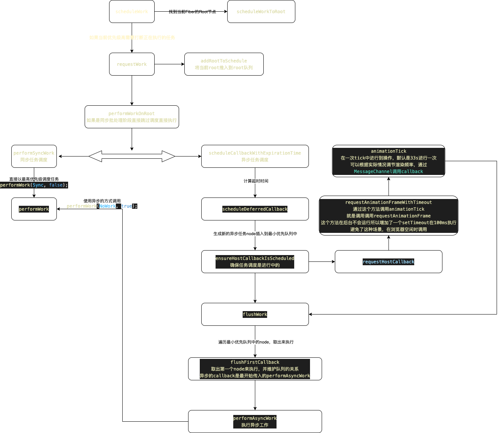

# scheduleWork开启任务调度

通过render初始化还是调用setState都会走到这个任务调度阶段，在这里进行了统一

先看一下主要的流程图


首先需要找到当前fiber属于的root节点，比如我是在一个底层组件调用了`setState`方法，需要在当前组件的Fiber向上寻找根的root节点，更新都是从root节点开始的，
如果当前触发的更新比之前更新的优先级高就打断正在执行的任务，如果没有开始工作开启工作

## scheduleWork入口

```js
// 执行更新任务的入口方法， setState和DOMrender都会走到这里
function scheduleWork(fiber: Fiber, expirationTime: ExpirationTime) {
  const root = scheduleWorkToRoot(fiber, expirationTime); // 找到当前的fiberRoot并更新expirationTime
  if (root === null) { // 找不到直接返回
    return;
  }
  if (
    !isWorking &&
    nextRenderExpirationTime !== NoWork &&
    expirationTime > nextRenderExpirationTime
  ) { // 当前优先级比执行的任务优先级高
    // This is an interruption. (Used for performance tracking.)
    interruptedBy = fiber;
    resetStack(); // 将已经更新的节点还原
  }
  markPendingPriorityLevel(root, expirationTime);
  if (
    // If we're in the render phase, we don't need to schedule this root
    // for an update, because we'll do it before we exit...
    !isWorking || // 没在工作阶段需要手动开启work
    isCommitting ||
    // ...unless this is a different root than the one we're rendering.
    nextRoot !== root
  ) {
    const rootExpirationTime = root.expirationTime;
    requestWork(root, rootExpirationTime);
  }
  if (nestedUpdateCount > NESTED_UPDATE_LIMIT) { // 防止循环调用
    // Reset this back to zero so subsequent updates don't throw.
    nestedUpdateCount = 0;
    invariant(
      false,
      'Maximum update depth exceeded. This can happen when a ' +
        'component repeatedly calls setState inside ' +
        'componentWillUpdate or componentDidUpdate. React limits ' +
        'the number of nested updates to prevent infinite loops.',
    );
  }
}
```

## requestWork进入调度阶段

会根据当前一些全局变量设定，还有expirationTime的值决定是要执行同步调度还是异步调度

```js
function requestWork(root: FiberRoot, expirationTime: ExpirationTime) {
  addRootToSchedule(root, expirationTime); // 将当前root推入到root队列，一般情况就一个
  if (isRendering) { // 已经在渲染阶段直接推出，会遍历执行新加入的update
    // Prevent reentrancy. Remaining work will be scheduled at the end of
    // the currently rendering batch.
    return;
  }
  if (isBatchingUpdates) { // 如果在批处理阶段
    // Flush work at the end of the batch.
    if (isUnbatchingUpdates) {
      // ...unless we're inside unbatchedUpdates, in which case we should
      // flush it now.
      nextFlushedRoot = root;
      nextFlushedExpirationTime = Sync;
      performWorkOnRoot(root, Sync, false);
    }
    return;
  }
  // TODO: Get rid of Sync and use current time?
  if (expirationTime === Sync) { // 同步调度
    performSyncWork();
  } else {
    scheduleCallbackWithExpirationTime(root, expirationTime);
  }
}
```

先来看一看同步调度，这个比较简单，直接调用执行work，最终异步也会调用这个方法所以后边一起说

```js
function performSyncWork() {
  performWork(Sync, false);
}
```

再看看异步调度，基本上大部分任务都是异步调度的

```js
function scheduleCallbackWithExpirationTime(
  root: FiberRoot,
  expirationTime: ExpirationTime,
) {
  if (callbackExpirationTime !== NoWork) { // 现有的调度任务已经有了
    // A callback is already scheduled. Check its expiration time (timeout).
    if (expirationTime < callbackExpirationTime) { // 已经存在的优先级高，不用再次开启调度
      // Existing callback has sufficient timeout. Exit.
      return;
    } else {
      if (callbackID !== null) { // 取消之前的调度
        // Existing callback has insufficient timeout. Cancel and schedule a
        // new one.
        cancelDeferredCallback(callbackID);
      }
    }
    // The request callback timer is already running. Don't start a new one.
  } else {
    startRequestCallbackTimer();
  }

  callbackExpirationTime = expirationTime;
  const currentMs = now() - originalStartTimeMs;

  const expirationTimeMs = expirationTimeToMs(expirationTime); // 转化为类似m的时间，优先级越高越小
  const timeout = expirationTimeMs - currentMs; // 计算一个timeout时间，优先级越高这个值越小
  callbackID = scheduleDeferredCallback(performAsyncWork, {timeout}); // 执行异步调度
}
```

## scheduleDeferredCallback

执行异步调度的核心代码
我们传入了timeout时间，和当前时间进行相加，就算出了一个绝对的时间，在这个时间之前要保证更新，要不然就是任务已经超时了，生成一个调度节点，这个也是用链表维护的，在之后的版本中会换成最小堆的数据结构，我们要找到第一个比当前过期时间大的节点插入到这个节点前边，`ensureHostCallbackIsScheduled`用来确认调度已经开始了

```js
function unstable_scheduleCallback(callback, deprecated_options) {
  var startTime =
    currentEventStartTime !== -1 ? currentEventStartTime : getCurrentTime();

  var expirationTime;
  if (
    typeof deprecated_options === 'object' &&
    deprecated_options !== null &&
    typeof deprecated_options.timeout === 'number'
  ) {
    // FIXME: Remove this branch once we lift expiration times out of React.
    // 目前都会走到这里else不会进入
    expirationTime = startTime + deprecated_options.timeout;
  } else {
  }
  var newNode = {
    callback,
    priorityLevel: currentPriorityLevel,
    expirationTime,
    next: null,
    previous: null,
  };

  // Insert the new callback into the list, ordered first by expiration, then
  // by insertion. So the new callback is inserted any other callback with
  // equal expiration.
  // 将新的任务节点插入队列，是按照过期时间排列，最先过期的在前边
  if (firstCallbackNode === null) {
    // This is the first callback in the list.
    firstCallbackNode = newNode.next = newNode.previous = newNode;
    ensureHostCallbackIsScheduled();
  } else {
    var next = null;
    var node = firstCallbackNode;
    do {
      if (node.expirationTime > expirationTime) {
        // The new callback expires before this one.
        next = node;
        break;
      }
      node = node.next;
    } while (node !== firstCallbackNode);

    if (next === null) { // 如果没有比当前小的放在第一个
      // No callback with a later expiration was found, which means the new
      // callback has the latest expiration in the list.
      next = firstCallbackNode;
    } else if (next === firstCallbackNode) {
      // The new callback has the earliest expiration in the entire list.
      firstCallbackNode = newNode;
      ensureHostCallbackIsScheduled();
    }

    var previous = next.previous;
    previous.next = next.previous = newNode;
    newNode.next = next;
    newNode.previous = previous;
  }

  return newNode;
}
```

这里开始异步调度过程比较复杂有两个api需要先看下`requestAnimationFrame`,`MessageChannel`这是一个宏任务调度方式,通过requestAnimationFrame在浏览器空闲的时候通知MessageChannel接收消息然后执行之前传入的回调`flushWork`,这里开始执行真正的更新，之前都是为了合理调度任务做铺垫

```js
requestHostCallback = function(callback, absoluteTimeout) {
  scheduledHostCallback = callback;
  timeoutTime = absoluteTimeout;
  if (isFlushingHostCallback || absoluteTimeout < 0) {
    // Don't wait for the next frame. Continue working ASAP, in a new event.
    port.postMessage(undefined);
  } else if (!isAnimationFrameScheduled) {
    // If rAF didn't already schedule one, we need to schedule a frame.
    // TODO: If this rAF doesn't materialize because the browser throttles, we
    // might want to still have setTimeout trigger rIC as a backup to ensure
    // that we keep performing work.
    isAnimationFrameScheduled = true;
    requestAnimationFrameWithTimeout(animationTick);
  }
};
var requestAnimationFrameWithTimeout = function(callback) {
  // schedule rAF and also a setTimeout
  rAFID = localRequestAnimationFrame(function(timestamp) {
    // cancel the setTimeout
    localClearTimeout(rAFTimeoutID);
    callback(timestamp);
  });
  rAFTimeoutID = localSetTimeout(function() {
    // cancel the requestAnimationFrame
    localCancelAnimationFrame(rAFID);
    callback(getCurrentTime());
  }, ANIMATION_FRAME_TIMEOUT);
};
```

这里最终还是会调用performAsyncWork，最终还是调用了performWork只不过和同步参数不一样

## performWork

这个方法会根据root是否还有到期时间执行performWorkOnRoot

```js
function performWork(minExpirationTime: ExpirationTime, isYieldy: boolean) {
  // Keep working on roots until there's no more work, or until there's a higher
  // priority event.
  findHighestPriorityRoot(); // 找到优先级最高的root，一般root也就一个

  if (isYieldy) { // 是否可以打断
    recomputeCurrentRendererTime();
    currentSchedulerTime = currentRendererTime;
    while (
      nextFlushedRoot !== null &&
      nextFlushedExpirationTime !== NoWork &&
      minExpirationTime <= nextFlushedExpirationTime &&
      !(didYield && currentRendererTime > nextFlushedExpirationTime)
    ) {
      performWorkOnRoot(
        nextFlushedRoot,
        nextFlushedExpirationTime,
        currentRendererTime > nextFlushedExpirationTime, // 如果
      );
      findHighestPriorityRoot();
      recomputeCurrentRendererTime();
      currentSchedulerTime = currentRendererTime;
    }
  } else {
    while (
      nextFlushedRoot !== null &&
      nextFlushedExpirationTime !== NoWork &&
      minExpirationTime <= nextFlushedExpirationTime
    ) {
      performWorkOnRoot(nextFlushedRoot, nextFlushedExpirationTime, false);
      findHighestPriorityRoot();
    }
  }

  // We're done flushing work. Either we ran out of time in this callback,
  // or there's no more work left with sufficient priority.

  // If we're inside a callback, set this to false since we just completed it.
  if (isYieldy) {
    callbackExpirationTime = NoWork;
    callbackID = null;
  }
  // If there's work left over, schedule a new callback.
  if (nextFlushedExpirationTime !== NoWork) {
    scheduleCallbackWithExpirationTime(
      ((nextFlushedRoot: any): FiberRoot),
      nextFlushedExpirationTime,
    );
  }

  // Clean-up.
  finishRendering();
}
```

```js
```