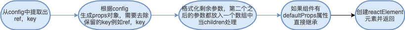

# createElement

这个是 jsx 帮我们转化生成 vnode 节点的基本方法，先看看这个方法生成的目标元素`ReactElement`

```js
const ReactElement = function(type, key, ref, self, source, owner, props) {
  const element = {
    // This tag allows us to uniquely identify this as a React Element
    $$typeof: REACT_ELEMENT_TYPE, // 内部标记这个是element节点

    // Built-in properties that belong on the element
    type: type, // 节点类型
    key: key, // 用来做diff使用
    ref: ref, // 当前元素dom引用
    props: props, // 标签中的属性
    // Record the component responsible for creating this element.
    _owner: owner, // 记录当前元素的父Fiber对象
  };
  return element;
```

这个方法帮我们生成了ReactElement元素，接下来看看这章主要的内容

```js
export function createElement(type, config, children) {
  let propName;

  // Reserved names are extracted
  const props = {};

  let key = null;
  let ref = null;
  let self = null;
  let source = null;

  if (config != null) { // 提取config中的ref和key
    if (hasValidRef(config)) {
      ref = config.ref;
    }
    if (hasValidKey(config)) {
      key = '' + config.key;
    }

    self = config.__self === undefined ? null : config.__self;
    source = config.__source === undefined ? null : config.__source;
    // Remaining properties are added to a new props object
    for (propName in config) { // 需要去除保留的props例如ref和key
      if (
        hasOwnProperty.call(config, propName) &&
        !RESERVED_PROPS.hasOwnProperty(propName)
      ) {
        props[propName] = config[propName];
      }
    }
  }
    // Children can be more than one argument, and those are transferred onto
  // the newly allocated props object.
  // 格式化children对传入的多余对象合并到一个数组中
  const childrenLength = arguments.length - 2;
  if (childrenLength === 1) {
    props.children = children;
  } else if (childrenLength > 1) {
    const childArray = Array(childrenLength);
    for (let i = 0; i < childrenLength; i++) {
      childArray[i] = arguments[i + 2];
    }
    props.children = childArray;
  }

  // Resolve default props
  // 赋值默认的props
  if (type && type.defaultProps) {
    const defaultProps = type.defaultProps;
    for (propName in defaultProps) {
      if (props[propName] === undefined) {
        props[propName] = defaultProps[propName];
      }
    }
  }
  return ReactElement(
    type,
    key,
    ref,
    self,
    source,
    ReactCurrentOwner.current,
    props,
  );
```

这个方法流程如下

